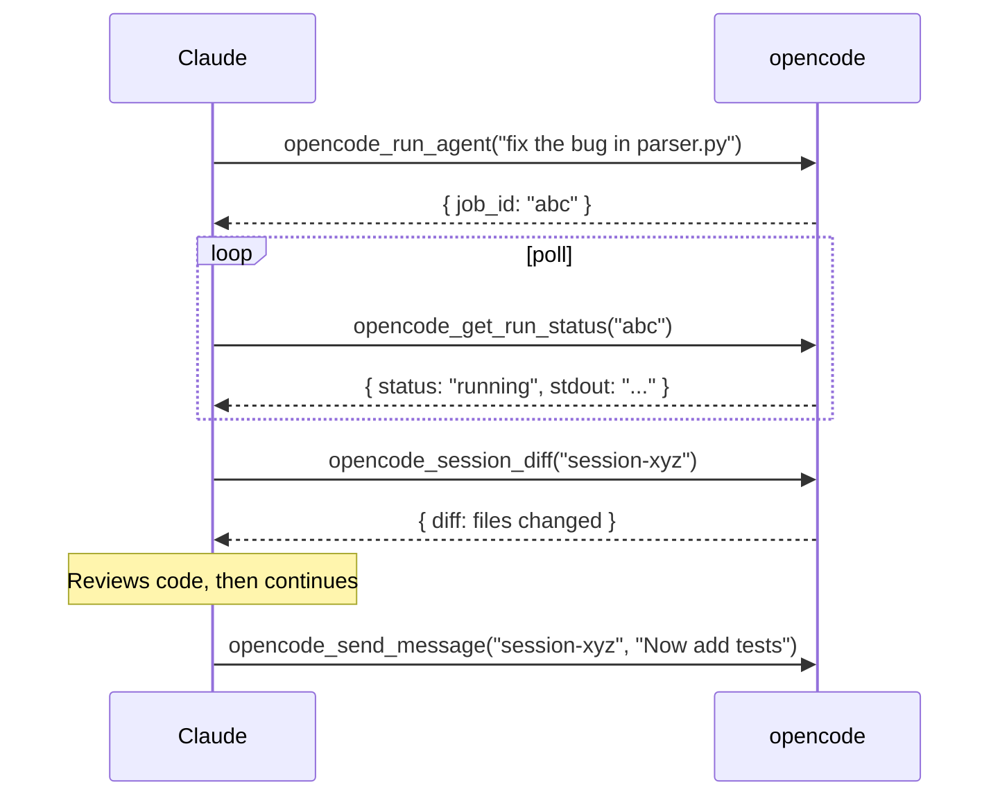

# Advanced Usage

## Async Agent Workflows

### Pattern 1: Launch → Poll → Review

```python
# Step 1: Launch agent in background
result = await opencode_run_agent(
    prompt="Add error handling to all API routes in src/api/",
    wait=False,
)
job_id = result["data"]["job_id"]
# → { success: true, data: { job_id: "abc123", status: "running" } }

# Step 2: Poll until done
import asyncio
while True:
    status = await opencode_get_run_status(job_id)
    if status["data"]["status"] in ("completed", "failed"):
        break
    await asyncio.sleep(2)

# Step 3: Review what changed
sessions = await opencode_list_sessions()
latest = sessions["data"]["sessions"][0]["id"]
diff = await opencode_session_diff(latest)
files = await opencode_session_files(latest)
```

### Pattern 2: Multi-Agent Parallel

```python
# Launch multiple agents concurrently
tasks = [
    opencode_run_agent(prompt=f"Implement feature {f}", wait=False)
    for f in ["auth", "logging", "tests"]
]
results = await asyncio.gather(*tasks)
job_ids = [r["data"]["job_id"] for r in results]

# Poll all
while True:
    statuses = await asyncio.gather(*[opencode_get_run_status(j) for j in job_ids])
    if all(s["data"]["status"] in ("completed", "failed") for s in statuses):
        break
    await asyncio.sleep(5)
```

### Pattern 3: Plan with Claude, Implement with opencode



## Session Analysis

```python
# See all files touched
files = await opencode_session_files("session-xyz")
for f in files["data"]["files"]:
    print(f"{f['path']} ({f['change_type']})")

# See raw diff
diff = await opencode_session_diff("session-xyz")

# Export for archiving
export = await opencode_export_session("session-xyz")
```

## Batch Operations

```python
# Cancel all running runs
runs = await opencode_list_runs()
for run in runs["data"]["runs"]:
    if run["status"] == "running":
        await opencode_cancel_run(run["job_id"])
```

## Multiple Projects

```python
# Run agent in specific project
result = await opencode_run_agent(
    prompt="Update dependencies",
    project="D:/projects/myapp",
)

# Check current project context
project = await opencode_get_project()
```

## Session Management Between Projects

OpenCode sessions are scoped to the project directory where you start them. To move session context between projects:

### Export / Import

```bash
# 1. Export a session from the current project
opencode export <session-id>   # → writes session.json

# 2. Switch to target project
cd /path/to/other/project

# 3. Import and resume
opencode import session.json
```

### Share URL → Import

```bash
# Share a session first (or copy an existing share URL)
opencode run --share "Explain this codebase"
# → https://opncd.ai/s/abc123

# From another project, import the share
opencode import https://opncd.ai/s/abc123
```

### MCP Tool: Continue Sessions Cross-Project

```python
import subprocess, json

# Export current session
out = subprocess.run(["opencode", "export", session_id], capture_output=True, text=True)
session_data = json.loads(out.stdout)

# Import into another project (via shell — opencode import reads from file)
with open("/tmp/session.json", "w") as f:
    json.dump(session_data, f)
subprocess.run(["opencode", "import", "/tmp/session.json"], cwd="D:/other/project")
```

Sessions preserve conversation history and tool output but re-initialize against the target project's codebase structure on import. Useful for handing off context between repos without losing the reasoning chain.

## OpenCode Custom Tools

The `.opencode/tools/` directory contains 6 TypeScript tools that extend opencode itself. When copied into an opencode project, opencode's LLM gains direct access to MCP fleet management, session inspection, and system diagnostics.

### Available Tools

| Tool Name | Call Pattern |
|-----------|-------------|
| `fleet_status` | `"Check which fleet servers are running"` |
| `fleet_launch` | `"Launch the app on port 10770"` |
| `sessions_list` | `"List my opencode sessions"` |
| `sessions_diff` | `"Show what files changed in session abc"` |
| `sessions_files` | `"Show files touched in session abc"` |
| `runs_list` | `"List recent agent runs"` |
| `runs_status` | `"Check status of run abc123"` |
| `system` | `"Show system resources"` |
| `providers` | `"List configured LLM providers"` |
| `tools` | `"List all MCP tools"` |

### Installation

```bash
cp .opencode/tools/* your-project/.opencode/tools/
```

Restart opencode — tools are auto-loaded from `.opencode/tools/` on startup. The LLM will call them by name when the task matches the tool's purpose.

### How They Work

Each `.ts` file defines tools using `@opencode-ai/plugin`'s `tool()` helper. On invocation, they call `http://127.0.0.1:10951/api/*` endpoints on the FastAPI backend, which either proxies to opencode serve or queries the local job store. The backend must be running (`.\start.ps1` or `uv run python -m api.main`).

### Viewing Tool Source

Browse all tools with source code at `http://localhost:10950/oc-tools` in the webapp, or query the API directly:

```bash
curl http://127.0.0.1:10951/api/opencode-tools       # list all
curl http://127.0.0.1:10951/api/opencode-tools/fleet  # single tool source
```
