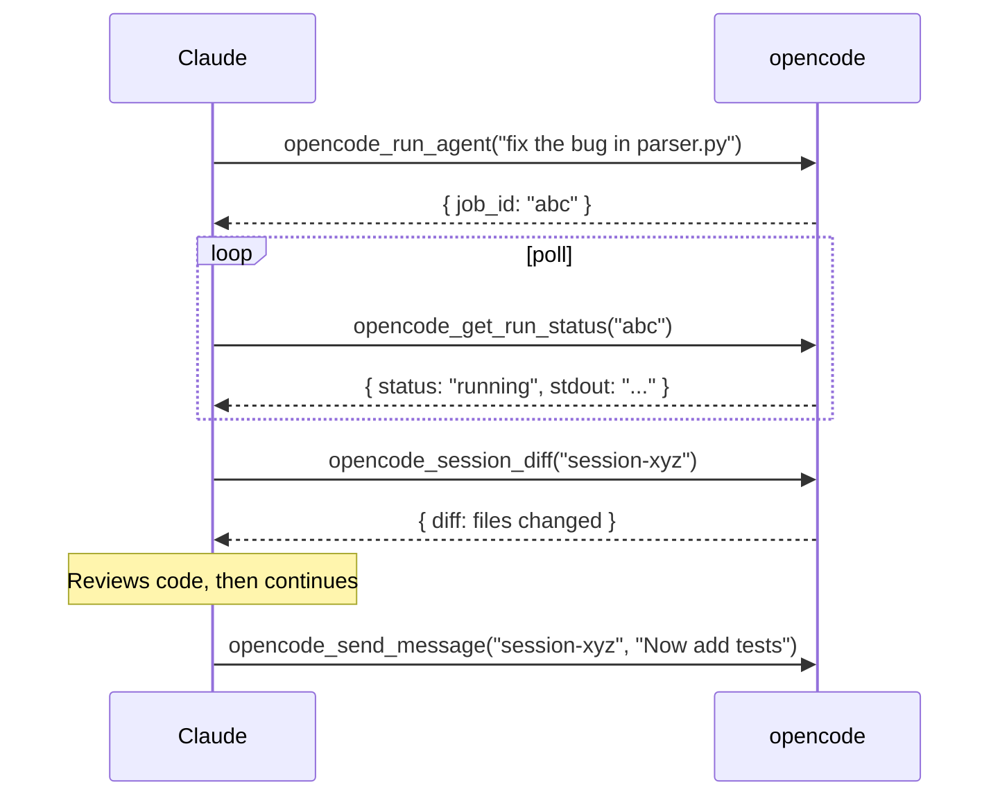

# Advanced Usage

## Async Agent Workflows

### Pattern 1: Launch → Poll → Review

```python
# Step 1: Launch agent in background
result = await opencode_run_agent(
    prompt="Add error handling to all API routes in src/api/",
    wait=False,
)
job_id = result["data"]["job_id"]
# → { success: true, data: { job_id: "abc123", status: "running" } }

# Step 2: Poll until done
import asyncio
while True:
    status = await opencode_get_run_status(job_id)
    if status["data"]["status"] in ("completed", "failed"):
        break
    await asyncio.sleep(2)

# Step 3: Review what changed
sessions = await opencode_list_sessions()
latest = sessions["data"]["sessions"][0]["id"]
diff = await opencode_session_diff(latest)
files = await opencode_session_files(latest)
```

### Pattern 2: Multi-Agent Parallel

```python
# Launch multiple agents concurrently
tasks = [
    opencode_run_agent(prompt=f"Implement feature {f}", wait=False)
    for f in ["auth", "logging", "tests"]
]
results = await asyncio.gather(*tasks)
job_ids = [r["data"]["job_id"] for r in results]

# Poll all
while True:
    statuses = await asyncio.gather(*[opencode_get_run_status(j) for j in job_ids])
    if all(s["data"]["status"] in ("completed", "failed") for s in statuses):
        break
    await asyncio.sleep(5)
```

### Pattern 3: Plan with Claude, Implement with opencode



## Session Analysis

```python
# See all files touched
files = await opencode_session_files("session-xyz")
for f in files["data"]["files"]:
    print(f"{f['path']} ({f['change_type']})")

# See raw diff
diff = await opencode_session_diff("session-xyz")

# Export for archiving
export = await opencode_export_session("session-xyz")
```

## Batch Operations

```python
# Cancel all running runs
runs = await opencode_list_runs()
for run in runs["data"]["runs"]:
    if run["status"] == "running":
        await opencode_cancel_run(run["job_id"])
```

## Multiple Projects

```python
# Run agent in specific project
result = await opencode_run_agent(
    prompt="Update dependencies",
    project="D:/projects/myapp",
)

# Check current project context
project = await opencode_get_project()
```
